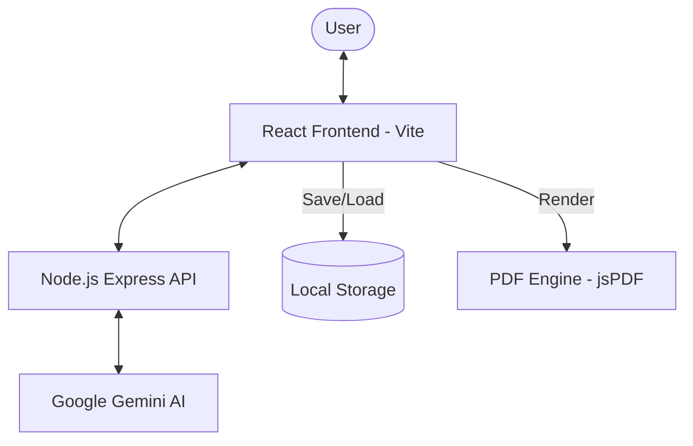

# 🚀 AI Resume Architect

**AI Resume Architect** is an enterprise-grade, high-fidelity resume generation platform. It leverages state-of-the-art AI (Google Gemini 1.5 Flash) to transform raw career data into professionally architected, high-impact resumes. Designed with a premium glassmorphic interface, it provides a seamless 7-step wizard experience for job seekers.


---

## ✨ Core Features

- **7-Step Professional Wizard**: Granular data collection covering:
  - Contact Information
  - Social Presence (LinkedIn, GitHub, etc.)
  - Professional Goals & Skills
  - Work Experience (with "Fresher" mode support)
  - Key Projects & Portfolio
  - Academic Background
  - Achievements & Awards
- **AI-Powered Content Generation**: Integrates with Google Gemini to architect professional summaries and action-oriented bullet points.
- **High-Fidelity PDF Export**: Dynamic PDF generation using `html2canvas` and `jsPDF` with support for multi-page resumes.
- **Persistence & Portability**: 
  - Automatic local storage persistence for session recovery.
  - JSON Import/Export for manual data portability.
- **Premium UI/UX**: Sleek, dark-mode interface featuring CSS-based glassmorphism, smooth micro-animations, and responsive layouts.

---

## 🏗️ System Architecture

The system follows a modern decoupled architecture:



### 🔄 Workflow Lifecycle
1. **Data Collection**: User navigates through the multi-step wizard.
2. **AI Orchestration**: Frontend aggregates data and transmits it to the Node.js backend.
3. **Prompt Engineering**: The backend sanitizes inputs and constructs a structured prompt for the LLM.
4. **Intelligent Synthesis**: Gemini 1.5 Flash generates a structured JSON response containing the resume content.
5. **Real-time Preview**: The frontend parses the AI response and renders a high-fidelity preview.
6. **Final Delivery**: User exports the result as a professional PDF or raw JSON data.

---

## 🛠️ Installation & Setup

### Prerequisites
- Node.js (v18+)
- Google Gemini API Key

### 1. Repository Setup
```bash
git clone https://github.com/patelpreet332/AI-Resume-Genrator.git
cd AI-Resume-Genrator
```

### 2. Backend Configuration
```bash
cd backend
npm install
cp .env.example .env
# Edit .env and add your GEMINI_API_KEY
npm run dev
```

### 3. Frontend Configuration
```bash
cd ../frontend
npm install
cp .env.example .env
# Edit .env if your backend port differs from 3000
npm run dev
```

The application will be accessible at `http://localhost:5173`.

---

## ⚙️ Environment Variables

### Backend (`/backend/.env`)
| Variable | Description | Default |
|----------|-------------|---------|
| `PORT` | API Server Port | `3000` |
| `GEMINI_API_KEY` | Google AI API Key | `Required` |

### Frontend (`/frontend/.env`)
| Variable | Description | Default |
|----------|-------------|---------|
| `VITE_PORT` | Dev Server Port | `5173` |
| `VITE_API_URL` | Backend API Endpoint | `http://localhost:3000` |

---

## 🛡️ Security & Performance

- **Environment Isolation**: Sensitive API keys are strictly managed via environment variables and excluded from version control.
- **Input Sanitization**: Backend-side prompt construction ensures clean data transmission to AI models.
- **Optimized Rendering**: CSS-heavy styling reduces JS overhead, ensuring smooth 60fps animations.
- **PDF Engine**: Optimized capture logic handles high-resolution rendering and page-break calculations.

---

## 📸 Screenshots Section
*You can add project screenshots here later to showcase the premium UI.*

---

## 📄 License
This project is licensed under the MIT License - see the LICENSE file for details.

---
**Developed with Precision.** Ready for enterprise deployment.